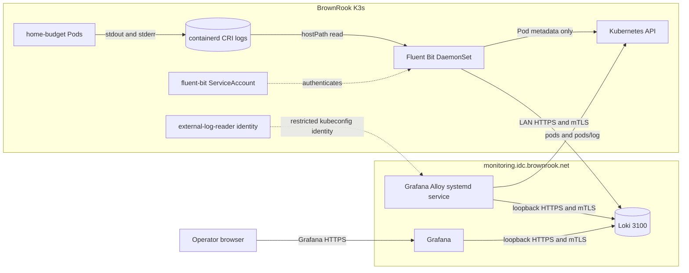
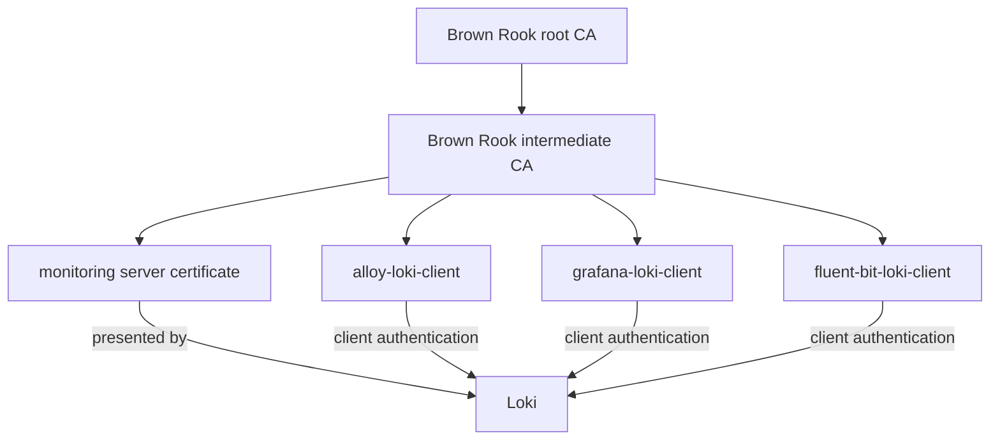
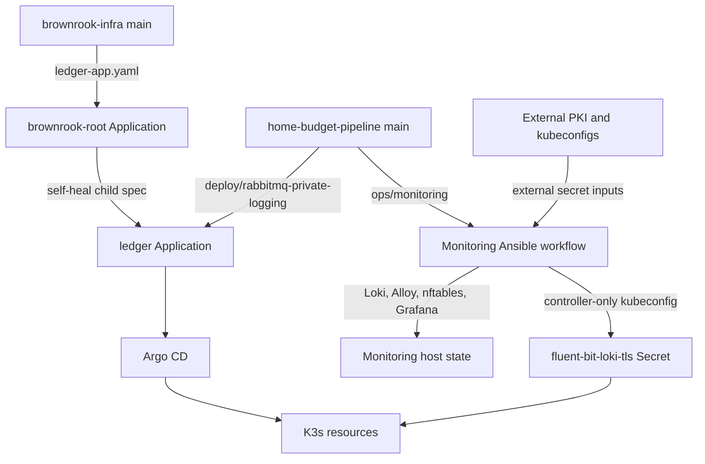
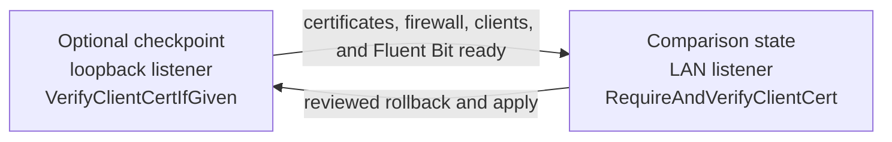

# Kubernetes log collection design

This document defines the production design for comparing an in-cluster
Fluent Bit agent with an external Grafana Alloy Kubernetes API collector. For
deployment, certificate rotation, validation commands, and rollback, see the
[Kubernetes log forwarding runbook](log-forwarding.md).

## Scope and design goals

Both paths observe the same application stdout/stderr without changing Ledger
application code. They write independent copies to the same Loki instance and
identify their source with a bounded `collection` label.

The design has four goals:

1. preserve a vendor-compatible path that installs no collector in K3s;
2. compare that path with a node-level agent under the same workload;
3. keep Loki off the unauthenticated LAN by requiring private-CA client
   identities; and
4. make host and Kubernetes desired state reproducible without storing private
   keys, tokens, kubeconfigs, or passwords in Git.

The comparison is intentionally dual-write. Duplicate events across the two
`collection` values are expected and are part of the evaluation, not an
application-processing duplicate.

## Production topology



Loki terminates TLS itself on port 3100; NGINX is not in the Loki data path.
The monitoring-host firewall permits that port only from loopback and the
approved K3s node address. Grafana remains the normal operator query surface.

## Collection paths

### Method A: node agent

```text
Pod stdout/stderr
  -> containerd CRI file
  -> Fluent Bit tail and multiline parsing
  -> Kubernetes metadata enrichment
  -> bounded labels and credential redaction
  -> filesystem buffer
  -> Loki HTTPS push with fluent-bit-loki-client
```

The `deploy/rabbitmq-private-logging` Kustomize overlay adds one Fluent Bit Pod
per eligible Linux node. It reads only
`/var/log/containers/*_home-budget_*.log`, excludes its own file, and uses a
namespace Role only for Pod metadata. Its tail database and buffered chunks
persist at `/var/lib/home-budget/fluent-bit` on the node.

The output retries without a fixed retry limit and caps filesystem use at
256 MiB. The Pod requests 50 millicores and 64 MiB, with limits of 300
millicores and 256 MiB. Its port 2020 endpoints expose health, output metrics,
and buffer state.

### Method B: external Kubernetes API collector

```text
Pod stdout/stderr
  -> Kubernetes pods/log API
  -> external Alloy discovery and stream
  -> bounded relabeling and credential redaction
  -> Alloy WAL
  -> Loki loopback HTTPS push with alloy-loki-client
```

Alloy runs as a systemd service on the monitoring host. It discovers only the
`home-budget` namespace using a dedicated kubeconfig. The corresponding Role
allows `get`, `list`, and `watch` on Pods plus `get` on `pods/log`; it cannot
read Secrets or other namespaces. No Alloy workload, agent, or sidecar runs in
K3s.

This path represents the vendor boundary: BrownRook needs a supported
Kubernetes API endpoint and read-only credential, but no node access or
permission to install software in the application cluster.

## Trust and identity design



Each Loki consumer has a separate leaf identity with the `clientAuth` extended
key usage. All clients validate the server name
`monitoring.idc.brownrook.net` against the Brown Rook root. In the enforced
state, Loki uses `RequireAndVerifyClientCert`; a TCP connection that passes the
firewall still cannot use Loki without a trusted client certificate.

The Kubernetes API trust path is separate. Alloy validates the K3s API CA and
authenticates with the `external-log-reader` service-account token. That token
does not grant access to the Loki endpoint, and the Loki certificates do not
grant Kubernetes access.

| Identity or secret | Installed location | Capability |
| --- | --- | --- |
| `external-log-reader` kubeconfig | Monitoring host, readable by Alloy | Discover Pods and read Pod logs in `home-budget` only |
| `alloy-loki-client` | Monitoring host, readable by Alloy | Write/query Loki through loopback mTLS |
| `grafana-loki-client` | Grafana secure datasource fields | Query Loki through loopback mTLS |
| `fluent-bit-loki-client` | Kubernetes Secret mounted by Fluent Bit | Write to Loki from the approved K3s node |
| Monitoring server key | Monitoring host, `monitoring-tls` group | Terminate Loki HTTPS for the declared DNS name |

CA signing keys, client private keys at rest, kubeconfigs, tokens, and the
Grafana administrator password are external inputs. Ansible uses `no_log` for
secret-bearing operations and does not commit or render their values into CI
artifacts.

## Event and label contract

Both paths retain the original application message after decolorization and
credential-pattern redaction. High-cardinality values such as receipt hashes,
filenames, request IDs, `run_uuid`, and `pass_id` remain in message content.
They are never deliberately promoted to Loki labels.

| Label | Source | Cardinality rule |
| --- | --- | --- |
| `cluster` | Static deployment value | One value per cluster |
| `environment` | Static deployment value | One value per environment |
| `collection` | Static collector value | `fluent-bit` or `kubernetes-api` |
| `namespace` | Kubernetes metadata | Restricted to `home-budget` in this design |
| `pod` | Kubernetes metadata | Workload lifecycle cardinality is accepted |
| `container` | Kubernetes metadata | Bounded by deployed workload definitions |
| `node` | Kubernetes metadata | Bounded by cluster nodes |
| `app`, `service` | Selected application labels | Present where the workload exposes a mapped label; Fluent Bit supplies a container fallback |
| `job` | Namespace and container | Bounded composition, not a receipt identity |

Loki or a client library may also derive bounded labels such as `instance` or
`service_name`. Arbitrary Pod labels and annotations are not copied. Queries
must use `collection`, not `collector`, to distinguish the paths.

## Delivery and failure semantics

| Condition | Fluent Bit node agent | External Alloy collector |
| --- | --- | --- |
| Loki unavailable | Retries and stores bounded chunks on the node filesystem | Queues writes in the enabled Alloy WAL on the monitoring host |
| Collector restart | Tail database resumes from node files that still exist | Rediscovers current Pods and reconnects to their API log streams |
| Pod replacement | Reads old and replacement CRI files while retained on the node | Discovers the replacement Pod; recovery from an already-terminated stream is API/runtime dependent |
| Kubernetes API unavailable | Continues tailing files; metadata refresh can become stale | Cannot discover or stream until API access returns |
| Node unavailable | That node's agent and local buffer are unavailable | API path can continue if the control plane and Pod log endpoint remain available |
| Monitoring host unavailable | Buffers on the K3s node up to configured limits | Alloy and Loki are both unavailable, so no independent external collector remains active |

The table states the designed mechanisms, not measured guarantees. Container
log rotation, buffer exhaustion, terminated-Pod retention, and overlapping
reconnects can still produce loss or duplicates. KAN-86 tests those boundaries
before selecting a preferred method.

Loki currently uses a single-process filesystem deployment under `/tmp/loki`,
an in-memory ring, and replication factor one. That is adequate for this
controlled comparison but is not a highly available or durable long-term Loki
storage design.

## GitOps ownership and reconciliation



The repositories own different layers:

| Desired state | Authoritative source |
| --- | --- |
| Ledger Argo CD Application path | `brownrook-infra/kubernetes/gitops/apps/ledger-app.yaml` |
| Fluent Bit workload, RBAC, configuration, and overlay | `deploy/fluent-bit` and `deploy/rabbitmq-private-logging` |
| Loki, Alloy, nftables, Grafana datasource, and external Secret reconciliation | `ops/monitoring` |
| Public certificates and private secret inputs | External PKI/controller files referenced by `.env.monitoring` |

Directly changing the child Application with `argocd app set` is not durable;
the `brownrook-root` parent restores the Git-declared path. Enabling or removing
the Fluent Bit overlay therefore starts with a reviewed `brownrook-infra`
change. Argo owns workload reconciliation, while the operator-invoked Ansible
workflow owns the external monitoring host and creates the externally sourced
TLS Secret without exposing its values.

The Loki rollout has two explicit states:



## Comparison method

Use uniquely identifiable, non-sensitive messages emitted once by the same Pod
and query each `collection` independently. Record:

- first-observed delivery latency from emission until the event is queryable;
- missing and duplicate count per collection;
- common and path-specific metadata;
- multiline traceback shape;
- behavior across application Pod, collector, Loki, and API restarts;
- buffered records, retries, failed output records, and dropped records;
- steady-state and outage CPU, memory, storage, and network use; and
- operator actions and credentials needed for deployment and recovery.

The Loki event timestamp alone is not an ingest timestamp. For this comparison,
poll both queries from the same controller clock and treat first observation as
an upper-bound delivery-latency measurement. Use the same poll interval for
both paths and record it with the results.

On 2026-09-14, the production probe `KAN86_DUAL_COLLECTOR_PROBE` was returned
through enforced mTLS in both `collection="fluent-bit"` and
`collection="kubernetes-api"`. Argo was healthy, the Fluent Bit DaemonSet was
fully rolled out, the namespace RBAC boundary passed, Grafana's datasource
proxy returned both collections through its separately stored mTLS identity,
and the final monitoring check reported zero drift. Restart, outage,
sustained-resource, and live receipt-event measurements remain comparison
work; no final preference should be inferred from the initial delivery proof
alone.

## Decision rule

For a BrownRook-managed cluster, select the node agent only if its measured
completeness or recovery advantage justifies its node access and per-node
resource cost. Select the API collector when the lower cluster footprint and
weaker privilege boundary meet the measured reliability requirement.

For a vendor-managed cluster where agent installation is prohibited, Method A
is unavailable. Method B is suitable only when the vendor can provide a stable
Kubernetes API endpoint, the documented namespace-scoped permissions, and log
retention long enough for the measured reconnect behavior.
