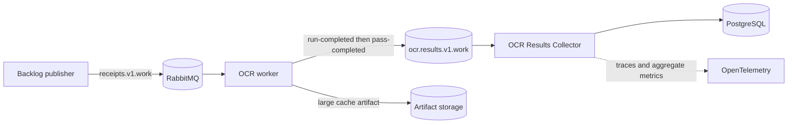

# OCR Results Collector

The OCR Results Collector is the durable boundary between compute-heavy OCR
workers and PostgreSQL. Workers need the receipt volume and RabbitMQ only. The
collector is the only OCR component that receives `DATABASE_URL`.

## Data flow



The work message is acknowledged only after every result publication is
confirmed. The result message is acknowledged only after its PostgreSQL
transaction commits. A worker crash before confirmed publication causes the
source work to be redelivered. A collector crash before acknowledgement causes
the result to be redelivered; the event ID and `(run_uuid, pass_id)` key make
the replay idempotent.

## Version 1 event contract

Both event types use a strict JSON envelope. Unknown envelope fields and
unsupported versions are rejected.

| Field | Contract |
| --- | --- |
| `schema_version` | Integer `1`. |
| `event_type` | `ocr.run-completed.v1` or `ocr.pass-completed.v1`. |
| `run_uuid` | Canonical UUID for one OCR run. |
| `pass_id` | `null` for a run event; positive integer for a pass event. |
| `source_sha256` | Immutable receipt-evidence SHA-256 identity. |
| `source_reference` | Relative POSIX receipt path. |
| `worker` | Bounded service name, host, and process ID. |
| `trace_context` | W3C `traceparent` and optional `tracestate`. |
| `occurred_at` | Timezone-aware ISO 8601 timestamp. |
| `attempt` | Collector delivery attempt, from 1 through 3. |
| `payload` | Event-specific validated content. |
| `artifacts` | URI, SHA-256, media type, byte size, and kind. |

The run event contains the selected OCR text and parsed receipt fields used for
querying and reconciliation. Pass events contain engine configuration, timing,
quality measurements, selection state, and status. Alternate full text,
rendered pages, bounding boxes, and other large data stay in the cache artifact
referenced by the run event. `OCR_ARTIFACT_URI_PREFIX` controls the URI prefix;
the Kubernetes deployment uses the durable receipt PVC namespace. An S3- or
other object-store-backed deployment sets `OCR_ARTIFACT_S3_BUCKET`,
`OCR_ARTIFACT_S3_PREFIX`, `OCR_ARTIFACT_S3_ENDPOINT`, and
`OCR_ARTIFACT_S3_REGION`; the worker uploads and confirms the object before it
publishes the run event. Copy `k8s/ocr-artifact-storage.example.yaml`, replace
its placeholders, and apply the ConfigMap and Secret. The optional resources
are loaded by the worker when present and require no manifest patch.

PostgreSQL records the envelope in `budget.ocr_result_events`, artifacts in
`budget.receipt_ocr_artifacts`, runs in `budget.receipt_ocr_runs`, and passes in
`budget.receipt_ocr_passes`. Receipt filenames, hashes, run UUIDs, and pass IDs
are trace/log fields and database columns, never Prometheus labels.

## Retry and dead-letter behavior

| Queue | Purpose |
| --- | --- |
| `ocr.results.v1.work` | New and redelivered result events. |
| `ocr.results.v1.retry` | A 60-second bounded retry delay for transient failures. |
| `ocr.results.v1.dead` | Invalid events and events that fail three attempts. |

Retry and dead queues are durable quorum queues with at-least-once dead
lettering. A DLQ publication includes bounded `error_type` and `error_message`
headers. If publishing a replacement cannot be confirmed, the collector does
not acknowledge the original delivery.

## Deployment and security

Apply the `deploy/rabbitmq` overlay after running `ledger database setup` so the
KAN-89 migration is present. The overlay deploys one CPU-heavy `receipt-worker`
without PostgreSQL credentials and two lightweight `ocr-results-collector`
replicas with the PostgreSQL secret. RabbitMQ credentials remain required by
the publisher, worker, and collector.

The telemetry overlay gives both deployments an mTLS OTLP client. The collector
continues durable writes when telemetry export is unavailable because exporters
run asynchronously and telemetry initialization errors are contained.

## Verification

After deployment:

```sh
kubectl -n home-budget rollout status deploy/receipt-worker
kubectl -n home-budget rollout status deploy/ocr-results-collector
kubectl -n home-budget logs deploy/ocr-results-collector --tail=100
```

Verify one correlated run:

```sql
SELECT e.message_id, e.event_type, e.run_uuid, e.pass_id,
       e.trace_context ->> 'traceparent' AS traceparent,
       e.persisted_at
  FROM budget.ocr_result_events e
 WHERE e.run_uuid = :'run_uuid'
 ORDER BY e.persisted_at, e.pass_id NULLS FIRST;
```

The receipt telemetry dashboard exposes all RabbitMQ queues through its queue
selector. Collector metrics report event throughput, persistence latency,
retries, failures, and dead-letter routing with bounded event/outcome labels.

## Retention, recovery, and rollback

Retain result-event audit rows and artifact references for the same period as
their receipt evidence. Deleting receipt evidence cascades its run, pass,
artifact, and event rows. Object-storage lifecycle policy must delete the
corresponding object no earlier than the database retention period; database
deletion does not delete an external object.

For recovery, restore PostgreSQL first, restore artifact storage, then resume
the collector and worker. Unacknowledged result events replay automatically.
Replay a DLQ event only after correcting its diagnostic cause; the same message
ID is safe to replay.

To roll back application code, scale `receipt-worker` to zero, let the collector
drain `ocr.results.v1.work`, then deploy the earlier application version. The
schema migration is additive and can remain in place. Do not remove collector
tables while a result queue contains messages. A forward rollback restores the
new worker and collector against the retained queues and schema.
