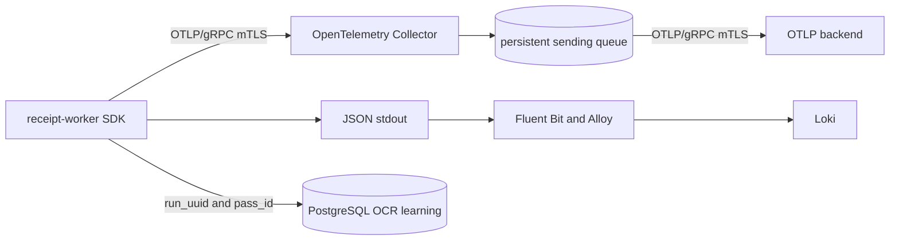

# Receipt-processing OpenTelemetry

BrownRook receipt workers emit application-defined traces and metrics over
OTLP/gRPC to an in-cluster OpenTelemetry Collector. Structured stdout logs keep
the same trace and OCR database identifiers, so operators can move between a
failed log, its trace, and the persisted OCR-learning row.

The deployment is opt-in. The existing
`deploy/rabbitmq-private-logging` path remains unchanged until the external
telemetry backend and certificate inputs are ready.

## Telemetry flow



The Python SDK uses a bounded `BatchSpanProcessor` and periodic metric reader.
Exporter work runs on SDK background threads; a missing or unavailable
Collector cannot block, crash, or roll back receipt processing. The Collector
uses a 2,048-element persistent sending queue and unlimited elapsed retry time
for the backend hop. A full queue can still drop new telemetry, and a worker
crash can lose data still held in its in-memory SDK queue.

## Trace contract

One `receipt.process` root span covers a database-atomic receipt attempt. The
following operation spans share its trace:

| Span | Purpose |
| --- | --- |
| `receipt.cache.lookup` | OCR cache decision and hit/miss state |
| `receipt.page.processing` | One source page's OCR and selection work |
| `receipt.ocr.pass` | One engine, DPI, PSM, and image-variant pass |
| `receipt.consensus.selection` | Base-pass choice and line consensus |
| `receipt.parsing` | Receipt field and line-item extraction |
| `receipt.reconciliation` | Match to an existing canonical expense |
| `receipt.persistence` | Evidence, OCR learning, attachment, and canonical writes |

`run_uuid` is created before a cache-miss OCR run. `pass_id` is assigned before
the corresponding engine invocation. The exact pair is attached to the OCR
span and later inserted into `budget.receipt_ocr_passes`. On a cache hit, the
root adopts the cached run UUID so it still correlates to the previously
persisted OCR run.

Each engine return immediately records the pass count/duration metrics and an
`OCR pass completed` log. Each OCR pass span records `ocr.engine`, `ocr.engine.type`, `ocr.dpi`,
`ocr.psm`, `ocr.variant`, `ocr.status`, `ocr.duration`,
`ocr.selected_base`, `ocr.structural_score`,
`ocr.consensus.line_coverage`, and `ocr.consensus.coverage_ratio`. The span is
started with the engine operation, enriched as soon as that page's consensus
is known, and ended immediately. Parsing and database work continue after the
span is available for export.

The root and pass spans retain source and run identifiers because traces are
the intended high-cardinality correlation surface. Those values are excluded
from metrics.

## Metric contract

| Name | Type | Unit | Allowed dimensions |
| --- | --- | --- | --- |
| `brownrook.receipt.processed` | Counter | `{receipt}` | `status` |
| `brownrook.receipt.processing.duration` | Histogram | `s` | `status` |
| `brownrook.receipt.ocr.pass.completed` | Counter | `{pass}` | `engine`, `engine_type`, `dpi`, `psm`, `variant`, `status` |
| `brownrook.receipt.ocr.pass.duration` | Histogram | `s` | `engine`, `engine_type`, `dpi`, `psm`, `variant`, `status` |
| `brownrook.receipt.ocr.pass.selected` | Counter | `{pass}` | `engine`, `engine_type`, `dpi`, `psm`, `variant`, `status` |

Receipt hashes, filenames, `run_uuid`, and `pass_id` are never metric
dimensions. They remain in traces and logs. KAN-88 owns Prometheus export,
recording rules, dashboards, alerts, and metric-to-trace navigation.

## Structured log contract

When `HOME_BUDGET_STRUCTURED_LOGS=true`, each worker record is one JSON object.
Every object has `trace_id`, `span_id`, `run_uuid`, and `pass_id` keys; values
are `null` outside the corresponding context. The `OCR pass completed` event is
emitted inside its pass span, so all four are populated. Log collection remains
stdout-based and continues through Fluent Bit and external Alloy.

Do not promote any of these four correlation values to Loki labels.

## Application configuration

The worker reads standard OpenTelemetry variables. The committed overlay sets
production defaults; change them in Git rather than application code.

| Variable | Committed value or behavior |
| --- | --- |
| `HOME_BUDGET_TELEMETRY_ENABLED` | `true` in the telemetry overlay; disabled otherwise |
| `HOME_BUDGET_STRUCTURED_LOGS` | `true` in the telemetry overlay |
| `OTEL_EXPORTER_OTLP_ENDPOINT` | Collector Service using `https` and port 4317 |
| `OTEL_EXPORTER_OTLP_CERTIFICATE` | CA used to verify the Collector server |
| `OTEL_EXPORTER_OTLP_CLIENT_CERTIFICATE` | Receipt-worker client certificate |
| `OTEL_EXPORTER_OTLP_CLIENT_KEY` | Receipt-worker client private key |
| `OTEL_BSP_MAX_QUEUE_SIZE` | 2,048 spans |
| `OTEL_BSP_MAX_EXPORT_BATCH_SIZE` | 256 spans |
| `OTEL_BSP_SCHEDULE_DELAY` | 1 second |
| `OTEL_BSP_EXPORT_TIMEOUT` | 5 seconds |
| `OTEL_METRIC_EXPORT_INTERVAL` | 5 seconds |
| `OTEL_TRACES_SAMPLER` | `parentbased_always_on` in production |

`OTEL_SERVICE_NAME`, `OTEL_SERVICE_VERSION`, and
`OTEL_DEPLOYMENT_ENVIRONMENT` supply resource identity. Kubernetes namespace,
Pod name/UID, node, and container name come from the Downward API. The SDK also
honors standard signal-specific OTLP endpoint, certificate, header,
compression, and timeout overrides.

Keep the application sampler at `parentbased_always_on` in production. The
Collector's `OTEL_TAIL_SAMPLING_PERCENTAGE` controls baseline trace volume and
defaults to 100. Its status-code policy retains ERROR traces. Because a receipt
can outlive the ten-second tail decision, a late application failure also emits
a short `receipt.process.failure` ERROR trace with the same `run_uuid`. This
ensures the failure signal is retained even if the earlier full trace was not;
the full trace remains authoritative when it was sampled.

## PKI and Secrets

The two OTLP hops use separate identities:

| Secret | Contents | Consumer |
| --- | --- | --- |
| `receipt-telemetry-client-tls` | Collector CA plus receipt-worker client certificate/key | receipt worker |
| `otel-collector-server-tls` | client CA plus Collector server certificate/key | Collector receiver |
| `otel-collector-backend-tls` | backend CA plus Collector client certificate/key | Collector exporter |
| `otel-backend` | backend `host:port` and verified server name | Collector exporter |

The external Alloy OTLP receiver also uses the dedicated
`otel-backend-server` identity. Its certificate covers
`monitoring.idc.brownrook.net`; the private key exists only in the external PKI
directory and on the monitoring host.

The Collector server certificate must cover
`otel-collector.home-budget.svc.cluster.local`; both client certificates need
the TLS `clientAuth` extended key usage. Keep CA signing keys and leaf private
keys outside Git. Store the four identities under the paths documented in
`ops/monitoring/README.md`. The repository's
[`secrets.example.yaml`](https://github.com/larocquemb/home-budget-pipeline/blob/main/deploy/opentelemetry/secrets.example.yaml)
documents shape only.

The `ops/monitoring` playbook validates these protected files, installs the
external server identity, and reconciles all four Kubernetes Secrets without
printing their contents. Restrict every private input file to mode `0400` or
`0600`. After rotating a telemetry identity, apply the playbook and restart the
receipt worker and Collector deployments so their gRPC clients and servers load
the new certificate material.

### Issue or rotate telemetry certificates

Perform this ceremony on the Mac with the Intermediate CA YubiKey inserted.
The PIN is entered only at the `p11tool` or `gnutls-certtool` prompt; never put
it in a command, environment file, log, or Git.

For initial issuance, run the checked-in helper from the repository root:

```zsh
scripts/issue_telemetry_certificates.sh
```

It uses `MONITORING_PKI_DIR` when set and otherwise defaults to
`~/brownrook-ca`. The helper stages all artifacts, refuses to replace an
existing identity directory, confirms the certificate in YubiKey slot 9C
matches `intermediate/intermediate_ca.crt`, requests the four signatures, builds
the full chains, and verifies their purposes, hostnames, lifetimes, key pairs,
and permissions before installation. Use `--pki-dir PATH` or `--provider PATH`
only when the environment differs from the documented defaults.

The commands below are the manual reference implemented by the helper and are
also the basis for a staged renewal ceremony.

For initial issuance, clone `fluent-bit-loki-client` for the two client
identities. They inherit its `clientAuth` request and GnuTLS template:

```zsh
cd ~/brownrook-ca/leafs

for name in receipt-telemetry-client otel-collector-backend-client; do
  mkdir -m 0755 "$name"
  cp fluent-bit-loki-client/fluent-bit-loki-client.cnf "$name/$name.cnf"
  cp fluent-bit-loki-client/fluent-bit-loki-client.tmpl "$name/$name.tmpl"
  sed -i '' "s/^CN[[:space:]]*=.*/CN = $name/" "$name/$name.cnf"

  openssl genpkey \
    -algorithm EC \
    -pkeyopt ec_paramgen_curve:prime256v1 \
    -out "$name/$name.key"
  chmod 0600 "$name/$name.key"
  openssl req -new -sha384 \
    -config "$name/$name.cnf" \
    -key "$name/$name.key" \
    -out "$name/$name.csr"
  openssl req -in "$name/$name.csr" -noout -verify
done
```

Clone the existing `monitoring` server identity for the two server
certificates. Change the CN and SAN in the OpenSSL request and the `dns_name`
in the GnuTLS template:

```zsh
cd ~/brownrook-ca/leafs

prepare_telemetry_server() {
  local name="$1"
  local dns_name="$2"

  mkdir -m 0755 "$name"
  cp monitoring/monitoring_leaf.cnf "$name/$name.cnf"
  cp monitoring/monitoring_leaf.tmpl "$name/$name.tmpl"
  sed -i '' \
    -e "s/^CN[[:space:]]*=.*/CN = $dns_name/" \
    -e "s/^DNS\\.1[[:space:]]*=.*/DNS.1 = $dns_name/" \
    "$name/$name.cnf"
  sed -i '' \
    "s/^dns_name[[:space:]]*=.*/dns_name = $dns_name/" \
    "$name/$name.tmpl"

  openssl genpkey \
    -algorithm EC \
    -pkeyopt ec_paramgen_curve:secp384r1 \
    -out "$name/$name.key"
  chmod 0600 "$name/$name.key"
  openssl req -new -sha384 \
    -config "$name/$name.cnf" \
    -key "$name/$name.key" \
    -out "$name/$name.csr"
  openssl req -in "$name/$name.csr" -noout -verify
}

prepare_telemetry_server \
  otel-backend-server \
  monitoring.idc.brownrook.net

prepare_telemetry_server \
  otel-collector-server \
  otel-collector.home-budget.svc.cluster.local

unset -f prepare_telemetry_server
```

Resolve the Intermediate CA private-key URI without printing it, then sign all
four CSRs. This is the same `gnutls-certtool` ceremony used for
`fluent-bit-loki-client`; expect a PIN prompt and YubiKey touch for each leaf:

```zsh
(
set -eu
cd ~/brownrook-ca

INTERMEDIATE_CA_KEY_URI="$(
  p11tool \
    --provider /opt/homebrew/lib/libykcs11.dylib \
    --login \
    --list-all \
    --only-urls |
  grep -E 'id=%02.*type=private|type=private.*id=%02' |
  head -n 1
)"
test -n "$INTERMEDIATE_CA_KEY_URI"

for name in \
  otel-backend-server \
  receipt-telemetry-client \
  otel-collector-server \
  otel-collector-backend-client
do
  (
    cd "leafs/$name"
    gnutls-certtool \
      --ask-pass \
      --hash=SHA384 \
      --generate-certificate \
      --template="$name.tmpl" \
      --load-request="$name.csr" \
      --load-ca-certificate=../../intermediate/intermediate_ca.crt \
      --load-ca-privkey="$INTERMEDIATE_CA_KEY_URI" \
      --provider=/opt/homebrew/lib/libykcs11.dylib \
      --outfile="$name.crt"

    cat "$name.crt" ../../intermediate/intermediate_ca.crt \
      >"$name.fullchain.crt"
    chmod 0644 "$name.crt" "$name.fullchain.crt"
  )
done
)
```

Verify the chains, purposes, and server names before allowing Ansible to read
the files:

```zsh
cd ~/brownrook-ca

for name in receipt-telemetry-client otel-collector-backend-client; do
  openssl verify \
    -CAfile root/root_ca.crt \
    -untrusted intermediate/intermediate_ca.crt \
    -purpose sslclient \
    "leafs/$name/$name.crt"
done

openssl verify \
  -CAfile root/root_ca.crt \
  -untrusted intermediate/intermediate_ca.crt \
  -purpose sslserver \
  leafs/otel-backend-server/otel-backend-server.crt
openssl x509 -checkhost monitoring.idc.brownrook.net -noout \
  -in leafs/otel-backend-server/otel-backend-server.crt

openssl verify \
  -CAfile root/root_ca.crt \
  -untrusted intermediate/intermediate_ca.crt \
  -purpose sslserver \
  leafs/otel-collector-server/otel-collector-server.crt
openssl x509 \
  -checkhost otel-collector.home-budget.svc.cluster.local \
  -noout \
  -in leafs/otel-collector-server/otel-collector-server.crt

find \
  leafs/otel-backend-server \
  leafs/receipt-telemetry-client \
  leafs/otel-collector-server \
  leafs/otel-collector-backend-client \
  -maxdepth 1 -name '*.key' -exec stat -f '%Sp %N' {} \;
```

Every verification must report `OK` or a matching hostname, and every key must
report mode `-rw-------`. Run `make monitoring-gitops-check` next; it repeats
these checks and also verifies certificate lifetime and certificate/key
pairing. For renewal, prepare and verify replacement artifacts under temporary
names before replacing the current key, certificate, and full chain together.

## Deploy

First render and inspect the complete opt-in overlay:

```bash
kubectl kustomize deploy/rabbitmq-private-telemetry >/tmp/ledger-telemetry.yaml
kubectl apply --dry-run=server -f /tmp/ledger-telemetry.yaml
```

First run `make monitoring-gitops-check`, `make monitoring-gitops-apply`, and a
second check. After all four Secrets exist and the backend OTLP receiver is
healthy, change
the parent-owned Argo CD `ledger` Application path in
`brownrook-infra/kubernetes/gitops/apps/ledger-app.yaml` from
`deploy/rabbitmq-private-logging` to
`deploy/rabbitmq-private-telemetry`. Merge that repository change and let the
`brownrook-root` Application reconcile it. Do not make a direct child
Application override; the parent will revert it.

Verify rollout and mTLS readiness:

```bash
kubectl --context brownrook-k3s1 -n home-budget rollout status deploy/otel-collector
kubectl --context brownrook-k3s1 -n home-budget rollout status deploy/receipt-worker
kubectl --context brownrook-k3s1 -n home-budget get pod,svc,pvc -l app=otel-collector
kubectl --context brownrook-k3s1 -n home-budget logs deploy/otel-collector --tail=100
```

An unauthenticated client must not be able to submit OTLP data. Confirm the
receiver rejects a TLS connection without the receipt-worker client identity:

```bash
kubectl --context brownrook-k3s1 -n home-budget run otlp-no-client \
  --rm -i --restart=Never --image=curlimages/curl:8.16.0 -- \
  curl --insecure --fail https://otel-collector:4317
```

The exact curl failure text is not significant; a successful unauthenticated
HTTP response would be a security failure. OTLP/gRPC itself is verified by the
worker test below.

## Synthetic OTLP demo

Use the repository helper to verify both mTLS hops and Tempo without processing
a real receipt:

```bash
make otlp-demo
```

The helper waits for the production Collector, mounts the
`receipt-telemetry-client-tls` Secret into a non-root, disposable
`telemetrygen` Pod, sends one trace over verified OTLP/gRPC mTLS, and deletes
the Pod. The image is pinned by digest, the service-account token is not
mounted, and no certificate or key value is placed on the command line.

After the Collector's ten-second tail-sampling window, copy the TraceQL query
printed by the helper into Grafana Explore with the `tempo` datasource. A
successful result contains one trace and two spans. To use a predictable
service name, run:

```bash
OTLP_DEMO_SERVICE=home-budget-otlp-demo make otlp-demo
```

Then query:

```traceql
{ resource.service.name = "home-budget-otlp-demo" }
```

The demo requires the `deploy/rabbitmq-private-telemetry` Argo CD overlay and
the four Secrets created by `make monitoring-gitops-apply`. Override
`KUBE_CONTEXT`, `KUBE_NAMESPACE`, `OTLP_DEMO_CLIENT_SECRET`, or
`OTLP_DEMO_ENDPOINT` only when testing a different environment.

## End-to-end verification

Choose one non-sensitive receipt reference and start a reprocess request while
following worker logs:

```bash
kubectl --context brownrook-k3s1 -n home-budget logs deploy/receipt-worker -f | \
  jq 'select(.message == "OCR pass completed") | {trace_id,span_id,run_uuid,pass_id,status}'

ledger receipts reprocess YYYY-MM-DD/receipt.pdf
```

Before the root run finishes, the log must show an OCR pass with non-null
correlation fields. Within the five-second metric export interval, query the
backend for `brownrook.receipt.ocr.pass.completed`. With the default 100-percent
Collector sampling, query traces for `receipt.ocr.pass` after its ten-second
decision window and copy its `run_uuid` and `pass_id`.

Confirm the same identity exists in PostgreSQL:

```sql
SELECT run_uuid, pass_id, engine, dpi, psm, variant, status,
       selected_base, consensus_coverage_ratio
  FROM budget.receipt_ocr_passes
 WHERE run_uuid = :'run_uuid'
   AND pass_id = :'pass_id';
```

The repository test performs the ordering assertion with an in-memory span
backend:

```bash
pytest -q -m 'not integration' tests/test_opentelemetry.py
```

It verifies that the pass has already reached the exporter while
`receipt.process` remains unfinished.

## Failure and recovery drill

Use a disposable receipt reprocess request. Scale the Collector down, start
the request, and confirm the worker continues through OCR and database commit:

```bash
kubectl --context brownrook-k3s1 -n home-budget scale deploy/otel-collector --replicas=0
ledger receipts reprocess YYYY-MM-DD/receipt.pdf
kubectl --context brownrook-k3s1 -n home-budget logs deploy/receipt-worker -f
```

The worker should report a normal `succeeded` or `review_required` outcome even
while the SDK reports export retries. Restore the Git-declared replica count by
syncing Argo CD, then submit a fresh request and confirm new trace and metric
data appears. The bounded SDK queue can lose old data during a long Collector
outage; recovery means receipt processing never stopped and subsequent
telemetry resumes.

For a backend-only outage, leave the Collector running and stop or firewall the
test backend. Confirm Collector logs show retries, its Pod remains ready, and
the `otel-collector-storage` PVC remains bound. Restore the backend and confirm
the persistent queue drains before declaring the drill successful.

## Rollback

Change the parent-owned Argo CD Application path back to
`deploy/rabbitmq-private-logging`, merge, and sync. This removes the Collector
and worker telemetry configuration without changing stdout log collection or
receipt data. Retain the Collector PVC until rollback acceptance in case its
sending queue still contains telemetry. Delete it only as a separate,
explicitly reviewed cleanup after confirming no recovery is required.

Application-only emergency rollback is also possible by setting
`HOME_BUDGET_TELEMETRY_ENABLED=false` and restarting the worker. Prefer the
GitOps path so the change is durable.
