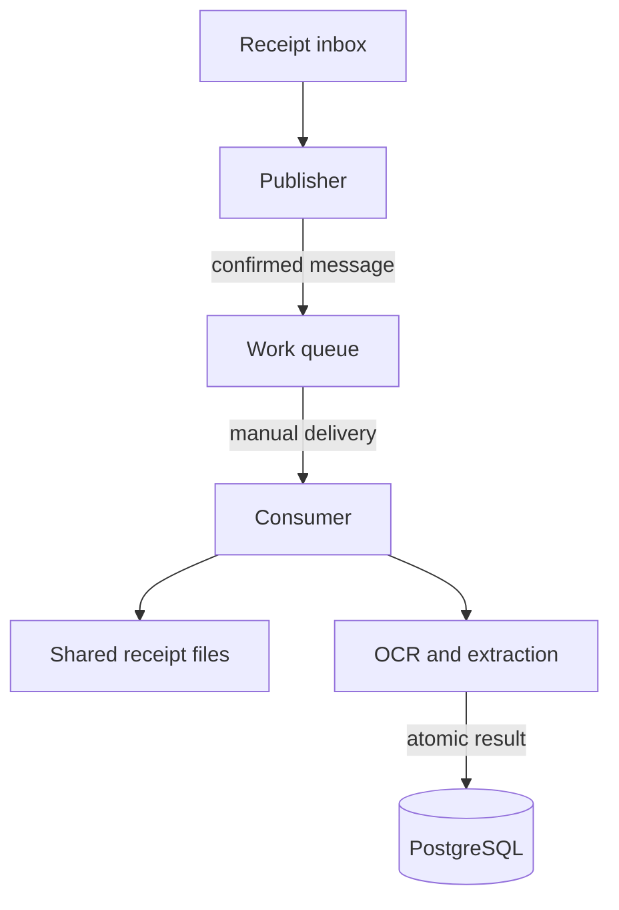
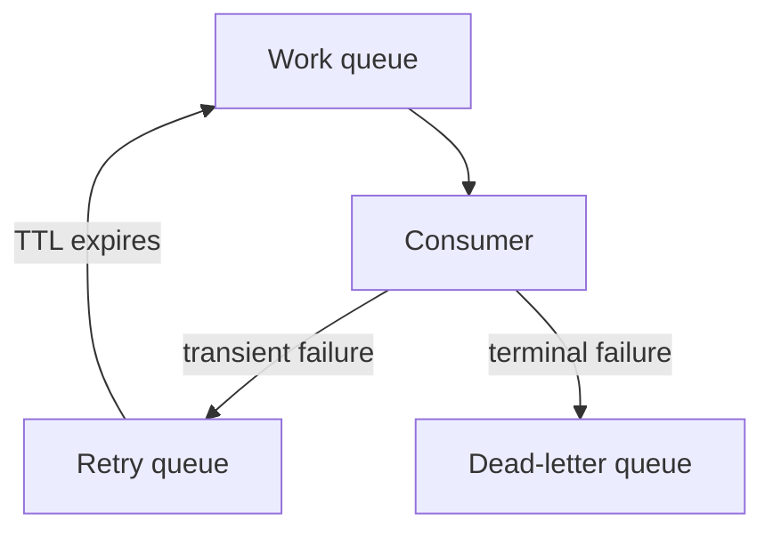
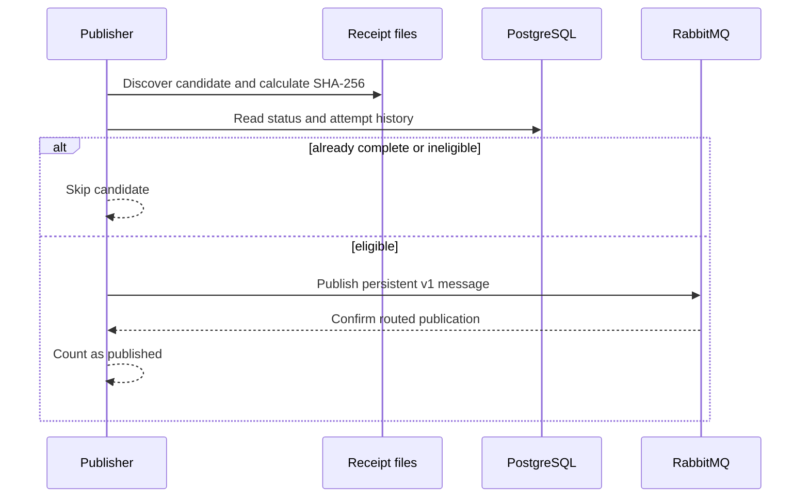
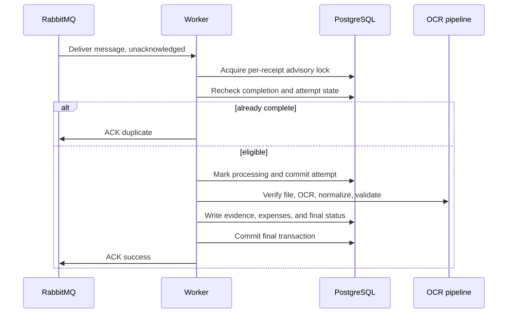
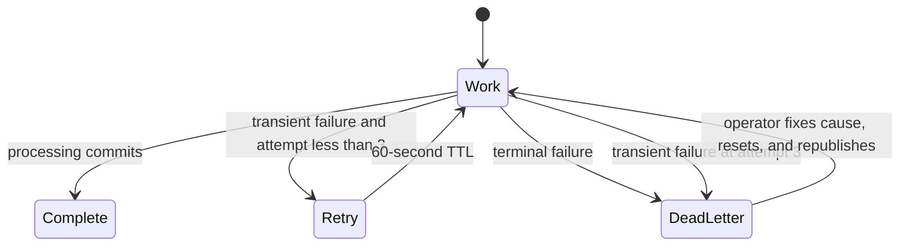

# RabbitMQ receipt processing design

This document explains how distributed receipt processing works and why the
system uses each reliability boundary. For setup, commands, recovery, and
Kubernetes rollout instructions, see the
[RabbitMQ receipt processing runbook](rabbitmq-receipts.md).

## Scope

RabbitMQ adds a distributed execution mode to the existing receipt backlog. It
does not replace receipt discovery, OCR, normalization, evidence storage, or
expense persistence. Both execution modes call the same receipt-processing
function:

- `ledger receipts process` discovers and processes receipts in one process.
- `ledger receipts publish` discovers eligible receipts and publishes work.
- `ledger receipts consume` receives work and processes it in a worker.

It uses the existing receipt and processing-status tables, so enabling this mode
does not require a database schema rebuild or migration.

The queued mode uses at-least-once delivery. A receipt can be delivered more
than once, but PostgreSQL state and per-receipt advisory locks prevent
concurrent or repeated completion.

## Components

### Processing path

The consumer acknowledges the delivery only after PostgreSQL commits the final
result. Shared storage contains the receipt and OCR cache; RabbitMQ messages
carry only the receipt hash and relative path.

### Failure path

The database remains the source of truth for receipt status and output. The
broker carries small work references; it does not contain the PDF or extracted
receipt data. Publisher and consumer instances must see the same receipt files
at the same relative paths.

## Message contract

Messages use the versioned JSON contract defined in
[`message.py`](https://github.com/larocquemb/home-budget-pipeline/blob/main/src/home_budget_pipeline/receipts/message.py). A v1 JSON body
contains:

| Field | Meaning |
| --- | --- |
| `version` | `1` for normal discovery work. |
| `source_sha256` | Content hash and durable receipt identity. |
| `source_reference` | Relative path below the configured source directory. |
| `attempt` | Delivery attempt, starting at `1` and capped at `3`. |

The AMQP `message_id` property is `receipt.v1:<source_sha256>` and remains
stable across retries.

Explicit reprocessing uses v2 with the same fields plus `request_id`, a canonical
UUID. Its AMQP type is `receipt.reprocess.v2` and its message ID is
`receipt.reprocess.v2:<source_sha256>:<request_id>`. Normal v1 bodies remain
unchanged. Both versions use the existing `receipts.v1` queues. Consumers must
be upgraded before v2 requests are published.

`ledger receipts reprocess SOURCE_REFERENCE` hashes one source file and publishes
a confirmed v2 request without changing database state. The consumer forces OCR
refresh and extraction replacement. Under the receipt lock, it tracks attempts
and completion in `budget.receipt_reprocess_requests`. The completion marker
commits in the same transaction as the evidence, canonical extraction, and
processing status. An already-completed request is skipped on redelivery, even
after a newer request has processed the same receipt. Each request has its own
three-attempt database budget, including attempts interrupted by worker crashes.
The request table survives disposable ingest schema rebuilds.

The CLI returns `queued` after broker confirmation. Each invocation generates a
new UUID unless `--request-id` is supplied; reuse that UUID when the publication
outcome is uncertain. Publisher confirmation and database completion remain
separate events, so worker logs provide the extraction outcome.

`source_reference` is a locator rather than an identity. Before processing, the
consumer rejects absolute paths and paths that escape the configured source
directory. It also verifies the file hash before and after reading the file.
This catches replacement or mutation while work is in progress.

Changing the contract requires a new version and compatible consumers. Unknown
versions and malformed messages are terminal failures and go to the
dead-letter queue.

## Broker topology

The topology is declared by both publisher and consumer, so either process can
start first.

| Purpose | Exchange and queue | Behavior |
| --- | --- | --- |
| Work | `receipts.v1.work` | Consumers receive active work here. |
| Retry | `receipts.v1.retry` | Messages wait for 60 seconds, then dead-letter back to work. |
| Dead letter | `receipts.v1.dead` | Holds terminal failures for inspection and explicit recovery. |

Each exchange is direct and durable. The queues are durable quorum queues.
Messages are persistent, publishing uses publisher confirms and mandatory
routing, and queue overflow rejects new publishes instead of silently dropping
old messages.

## Publishing lifecycle

The publisher reuses backlog discovery and queries PostgreSQL before publishing
each candidate.

There is no database-to-broker outbox transaction. If the publisher exits after
RabbitMQ confirms a message but before the command finishes reporting, a later
scan can publish that receipt again. Delivery is at least once, and the
consumer's database checks make duplicate work safe.

Receipts whose stored processing-attempt count has reached the configured
maximum are reported as exhausted. An operator must reset one with
`ledger receipts retry SOURCE_REFERENCE` before it becomes publishable.

## Consumer transaction and ACK boundaries

The consumer sets prefetch to one and receives with automatic acknowledgements
disabled. It acknowledges only after the durable outcome is known.

The processing marker is committed before OCR so attempts survive worker
failure. Evidence, expense changes, and the final receipt status are committed
together. A crash before the final commit leaves no partial completed result. A
crash after that commit but before the ACK causes redelivery; the next worker
sees the completed status and ACKs without repeating OCR.

OCR runs on a worker thread while the AMQP thread continues servicing the
connection. This prevents long OCR calls from starving RabbitMQ heartbeats.

## Idempotency and concurrency

PostgreSQL provides the distributed coordination boundary. A worker obtains a
session advisory lock derived from `source_sha256`, then checks the receipt
status while holding that lock. Only one worker can process a given receipt at
a time, even if duplicate messages are in the queue or several consumer
replicas are running.

The lock is per receipt. Different receipts can run concurrently. The local
`receipts process` command also uses the same per-receipt lock inside its wider
backlog lock, so local and RabbitMQ workers cannot process the same receipt at
the same time.

The completed database state is the idempotency record. A message for a receipt
in `succeeded` or `review_required` is acknowledged as a duplicate. The design
does not depend on RabbitMQ deduplication or message ordering.

## Retry and dead-letter behavior

Failures are classified by whether another attempt could reasonably succeed.

| Outcome | Database effect | Broker action |
| --- | --- | --- |
| Success or review required | Final status and evidence commit | ACK work message. |
| Duplicate completion | No new processing | ACK work message. |
| Transient failure before attempt 3 | Failure state is recorded | Confirm retry publish, then ACK work message. |
| Transient failure on attempt 3 | Failure state is recorded | Confirm dead-letter publish, then ACK work message. |
| Invalid contract, unsafe path, or hash mismatch | No receipt completion; a failure is recorded when processing had started | Confirm dead-letter publish, then ACK work message. |
| Retry or dead-letter publish cannot be confirmed | Existing delivery stays unacknowledged | Let connection closure return the original message to work. |

The original delivery is never acknowledged before the replacement retry or
dead-letter message is confirmed. This closes the gap in which work could be
lost between consuming one message and publishing its successor.

The message attempt and database attempt counters cover different failures. The
message counter limits application-level retry routing. The database counter
limits OCR processing starts, including starts interrupted by a worker crash.
A connection failure before processing can consume broker deliveries without
incrementing the database counter. The work queue also has a delivery limit of
20 to bound repeated crashes that never reach application settlement.

## Failure recovery

The design expects crashes and network failures at every boundary:

| Failure point | Recovery behavior |
| --- | --- |
| Before a publish is confirmed | The command fails; a later discovery scan can publish again. |
| After publish confirmation | RabbitMQ retains the persistent message; a duplicate publication is safe. |
| Before the processing marker commits | RabbitMQ redelivers; the database has no new attempt. |
| During OCR after the marker commits | The attempt remains visible and the message is retried or redelivered. |
| Before the final database commit | Transaction rollback prevents partial evidence or completion. |
| After final commit but before ACK | Redelivery is acknowledged as an already-complete duplicate. |
| During retry or dead-letter publication | The original delivery is requeued unless replacement publication is confirmed. |
| Worker shutdown | The worker stops accepting work, drains its current delivery, then closes cleanly. |

RabbitMQ protects queued messages, while PostgreSQL protects processing state.
The receipt filesystem needs its own durable storage and backup policy.

## Kubernetes deployment

The optional Kustomize overlay in
[`deploy/rabbitmq`](https://github.com/larocquemb/home-budget-pipeline/tree/main/deploy/rabbitmq)
adds:

- a RabbitMQ StatefulSet and persistent volume claim;
- a publisher patch for the scheduled backlog job;
- a long-running consumer Deployment;
- broker configuration plus credentials and URL sourced from Kubernetes configuration.

The base manifests stay usable without RabbitMQ. Applying the overlay opts the
deployment into queued processing. Publisher and workers must mount the same
receipt source and evidence storage, and all workers must connect to the same
PostgreSQL database.

Scaling the consumer Deployment increases parallelism across receipts. Prefetch
one limits each replica to one active delivery, while advisory locks serialize
duplicates for the same receipt.

## Guarantees and limits

| Property | Guarantee |
| --- | --- |
| Delivery | At least once. |
| Duplicate safety | Database completion checks and per-receipt advisory locks. |
| Concurrent processing | Parallel across receipts; serialized for one SHA-256 identity. |
| Result atomicity | Evidence, expense writes, and final status commit together. |
| Ordering | No ordering guarantee across different receipts. |
| Broker durability | Durable quorum queues and persistent confirmed messages. |
| File transport | Files are shared externally; they are not copied through RabbitMQ. |
| Exactly-once processing | Not claimed; the observable completed result is idempotent. |

## Implementation and verification map

| Concern | Implementation | Verification |
| --- | --- | --- |
| Contract and path validation | [`message.py`](https://github.com/larocquemb/home-budget-pipeline/blob/main/src/home_budget_pipeline/receipts/message.py) | `tests/test_receipt_queue.py` |
| Publisher, topology, ACK, retry, and DLQ | [`queue_ingest.py`](https://github.com/larocquemb/home-budget-pipeline/blob/main/src/home_budget_pipeline/receipts/queue_ingest.py) | `tests/test_receipt_queue.py`, `tests/test_receipt_queue_rabbitmq.py` |
| Processing transaction and advisory lock | [`backlog_ingest.py`](https://github.com/larocquemb/home-budget-pipeline/blob/main/src/home_budget_pipeline/receipts/backlog_ingest.py) | `tests/test_receipt_queue_postgres.py` |
| CLI commands | [`cli.py`](https://github.com/larocquemb/home-budget-pipeline/blob/main/src/home_budget_pipeline/cli.py) | `tests/test_receipt_retry_cli.py` |
| Kubernetes overlay | [`deploy/rabbitmq`](https://github.com/larocquemb/home-budget-pipeline/tree/main/deploy/rabbitmq) | `tests/test_receipt_queue_deployment.py` |

The PostgreSQL integration tests exercise competing workers and verify that a
receipt is processed once. The RabbitMQ integration tests exercise confirmed
publication, manual acknowledgements, retry delay, and dead-letter routing
against a real broker.
