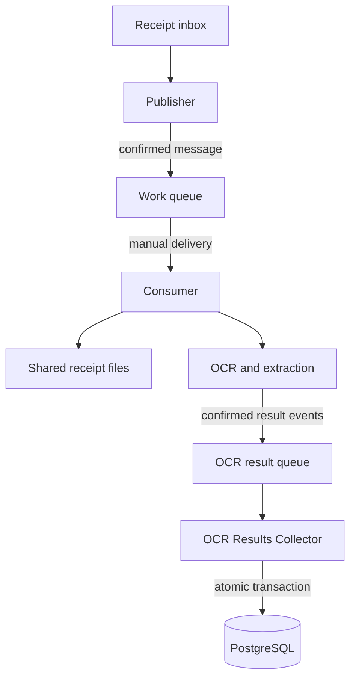
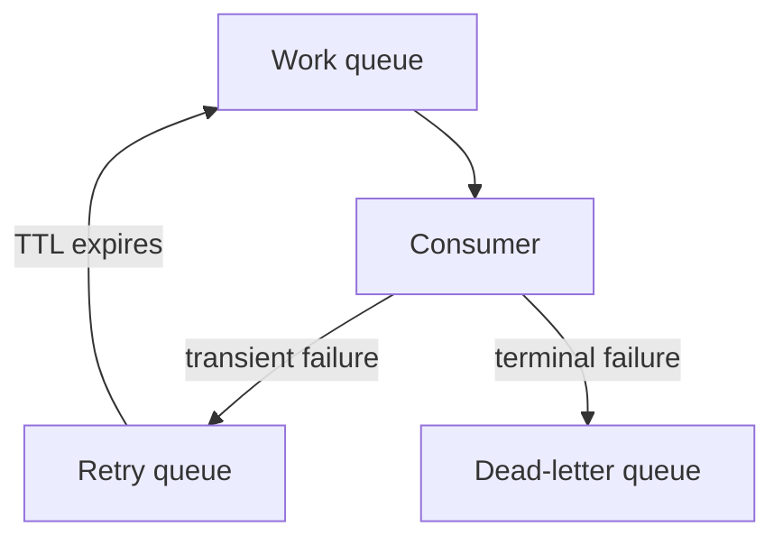
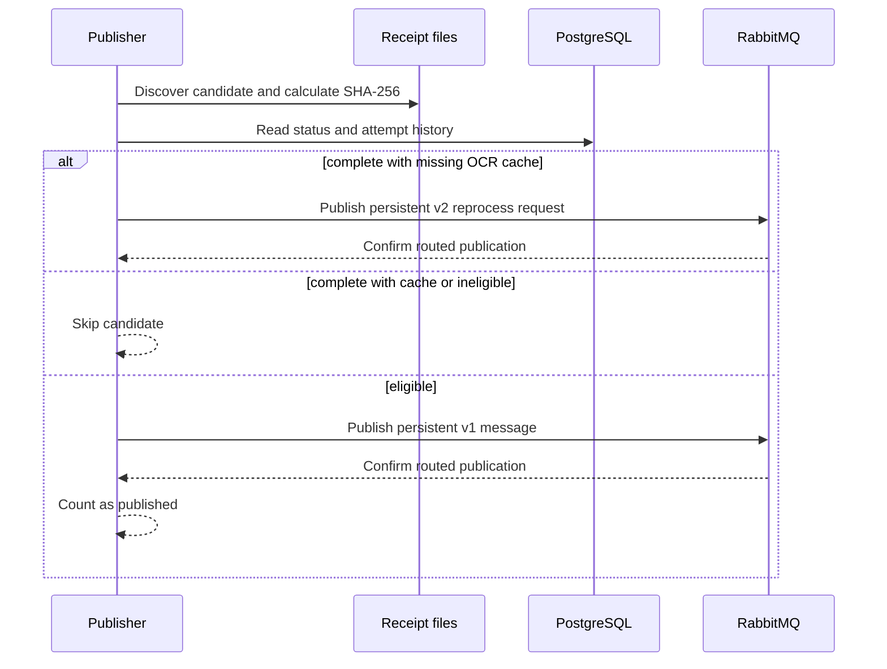
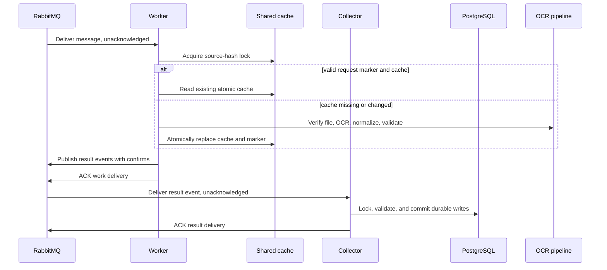
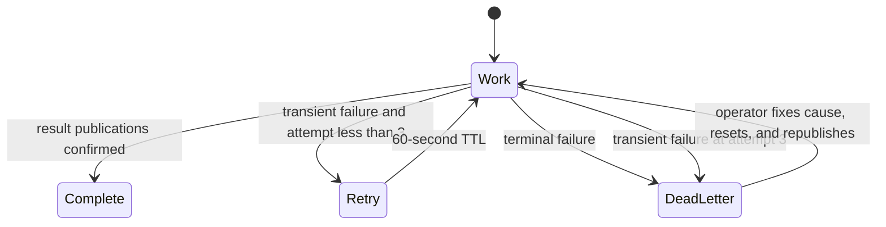

# RabbitMQ receipt processing design

This document explains how distributed receipt processing works and why the
system uses each reliability boundary. For setup, commands, recovery, and
Kubernetes rollout instructions, see the
[RabbitMQ receipt processing runbook](rabbitmq-receipts.md).

## Scope

RabbitMQ is the dispatch path for all receipt work and OCR results. Publishers
discover files and submit requests; workers invoke OCR and publish versioned
result events; the OCR Results Collector alone persists those results.

- `ledger receipts process` and `publish` queue eligible receipts.
- `ledger receipts reprocess` and `process --refresh-ocr-cache` queue full refreshes.
- `ledger ocr-cache rebuild` queues cache-only refreshes.
- `ledger receipts consume` processes messages in a worker.

Commands exit after confirmed publication. Broker failures are reported without
falling back to direct processing. Worker settings control cache location and
concurrency. The additive request tables track completion and bounded attempts.

The queued mode uses at-least-once delivery. Shared-volume locks serialize OCR
cache access for one source hash, request markers avoid repeating completed
refreshes, and collector-side PostgreSQL keys make result replay idempotent.

## Components

### Processing path

The worker acknowledges a work delivery only after every result event has been
confirmed by RabbitMQ. The collector acknowledges a result delivery only after
its PostgreSQL transaction commits. Shared storage contains the receipt and OCR
cache; RabbitMQ messages carry only the receipt hash, relative path, operation,
request identity, and bounded progress metadata.

In K3s, the `receipt-processor` CronJob is the publisher. Every 15 minutes it
checks inbox receipts against PostgreSQL completion status and cache-file
existence under `HOME_BUDGET_OCR_CACHE`. It sends missing-cache reprocess requests
through RabbitMQ. The `receipt-worker` consumer performs OCR and replaces saved
extraction results; it does not independently discover missing cache files.
Manual `receipts publish` and `receipts process` commands use the same discovery
and publication policy.

### Failure path

The database remains the source of truth for receipt status and output. The
broker carries small work references; it does not contain the PDF or extracted
receipt data. Publisher and consumer instances must see the same receipt files
at the same relative paths.

## Message contract

Messages use the versioned JSON contract defined in
[`message.py`](https://github.com/larocquemb/home-budget-pipeline/blob/main/src/home_budget_pipeline/receipts/message.py). A v1 JSON body
contains:

| Field | Meaning |
| --- | --- |
| `version` | `1` for normal discovery work. |
| `source_sha256` | Content hash and durable receipt identity. |
| `source_reference` | Relative path below the configured source directory. |
| `attempt` | Delivery attempt, starting at `1` and capped at `3`. |

The AMQP `message_id` property is `receipt.v1:<source_sha256>` and remains
stable across retries.

Explicit reprocessing uses v2 with the same fields plus `request_id`, a canonical
UUID. Its AMQP type is `receipt.reprocess.v2` and its message ID is
`receipt.reprocess.v2:<source_sha256>:<request_id>`. Normal v1 bodies remain
unchanged. Both versions use the existing `receipts.v1` queues. Consumers must
be upgraded before v2 requests are published.

`ledger receipts reprocess SOURCE_REFERENCE` hashes one source file and publishes
a confirmed v2 request without changing database state. The consumer forces OCR
refresh and extraction replacement. Under the receipt lock, it tracks attempts
and completion in `budget.receipt_reprocess_requests`. The completion marker
commits in the same transaction as the evidence, canonical extraction, and
processing status. An already-completed request is skipped on redelivery, even
after a newer request has processed the same receipt. Each request has its own
three-attempt database budget, including attempts interrupted by worker crashes.
The request table survives disposable ingest schema rebuilds.

The CLI returns `queued` after broker confirmation. Each invocation generates a
new UUID unless `--request-id` is supplied; reuse that UUID when the publication
outcome is uncertain. Publisher confirmation and database completion remain
separate events, so worker logs provide the extraction outcome.

`source_reference` is a locator rather than an identity. Before processing, the
consumer rejects absolute paths and paths that escape the configured source
directory. It also verifies the file hash before and after reading the file.
This catches replacement or mutation while work is in progress.

Changing the contract requires a new version and compatible consumers. Unknown
versions and malformed messages are terminal failures and go to the
dead-letter queue.

## Broker topology

The topology is declared by both publisher and consumer, so either process can
start first.

| Purpose | Exchange and queue | Behavior |
| --- | --- | --- |
| Work | `receipts.v1.work` | Consumers receive active work here. |
| Retry | `receipts.v1.retry` | Messages wait for 60 seconds, then dead-letter back to work. |
| Dead letter | `receipts.v1.dead` | Holds terminal failures for inspection and explicit recovery. |

Each exchange is direct and durable. The queues are durable quorum queues.
Messages are persistent, publishing uses publisher confirms and mandatory
routing, and queue overflow rejects new publishes instead of silently dropping
old messages.

## Publishing lifecycle

The publisher reuses backlog discovery and queries PostgreSQL before publishing
each candidate.

There is no database-to-broker outbox transaction. If the publisher exits after
RabbitMQ confirms a message but before the command finishes reporting, a later
scan can publish that receipt again. Delivery is at least once, and the
consumer's database checks make duplicate work safe.

Completed sources are checked for their current date-relative cache file or a
legacy hash-named cache. A missing cache produces a full v2 reprocess request,
even if the receipt's historical attempt count has reached the normal limit.
Its request UUID is derived from the source hash, relative path, and previous
completion timestamp, so repeated scans before processing reuse the same request
and attempt budget. After a new successful completion, another cache deletion
produces a fresh request. The consumer recreates OCR and replaces saved
extraction results; this is not a cache-only repair. Sources that stop being
completed during discovery are left to their current processing attempt.

Receipts whose stored processing-attempt count has reached the configured
maximum are reported as exhausted. An operator must reset one with
`ledger receipts retry SOURCE_REFERENCE` before it becomes publishable.

### Scheduled cache discovery and duplicate backlog

When a new or empty cache directory is introduced, many completed receipts can
become eligible for missing-cache repair at once. Every 15 minutes, the publisher
checks database status and cache existence again. It does not check whether an
equivalent request is already waiting in RabbitMQ or record a durable
"already queued" reservation. If workers have not reached those receipts, later
successful scans can publish additional copies of the same v2 requests.

The UUID derived from source hash, relative path, and previous completion time
identifies one logical repair request across those scans. RabbitMQ stores and
delivers each publication even when its message ID matches an existing message.
Workers serialize the source through a shared-volume lock. Once a v2 or v3
request produces an atomic cache file, a checksum-bearing request marker lets a
duplicate reuse the cache and republish the same logical result without
repeating OCR. The collector checks the request and result identities under its
PostgreSQL advisory lock. A later cache deletion invalidates the marker and a
new request can recreate the cache.

For example, if 100 completed receipts still lack caches and no worker starts
them during three successful discovery runs, RabbitMQ can hold 300 deliveries
for 100 logical repair requests. Once those repairs complete, the other 200
deliveries only require completion checks and ACKs. Queue depth can decline
slowly while OCR runs, then fall rapidly as workers reach completed duplicates.
With workers active during discovery, only sources still eligible at each scan
contribute to that scan's missing-cache publications.

This trades additional broker deliveries and inexpensive cache/result
idempotency checks for recovery through repeated discovery. Queue depth measures
outstanding deliveries, not unique receipts or remaining OCR runs. An empty
work queue can coexist with `review_required` receipts or dead-letter messages;
those outcomes still need operator attention.

## Consumer transaction and ACK boundaries

The consumer sets prefetch to one and receives with automatic acknowledgements
disabled. It acknowledges only after the durable outcome is known.

An interrupted worker leaves its work delivery unacknowledged. If its cache and
request marker were completed, the replacement worker reuses them; otherwise it
rebuilds under the same source lock. A result publication survives worker loss.
The collector commits evidence, expense changes, request completion, artifacts,
and event audit state transactionally. A collector crash after commit but before
ACK causes an idempotent result replay.

OCR runs on a worker thread while the AMQP thread continues servicing the
connection. This prevents long OCR calls from starving RabbitMQ heartbeats.

## Idempotency and concurrency

The shared receipt volume provides the worker coordination boundary. Every work
version uses a source-hash file lock, so different receipts run concurrently
while one receipt's cache is serialized across pods. Refresh requests use their
request UUID and cache checksum as a completion marker; changing or deleting the
cache invalidates it.

PostgreSQL provides the durable result boundary. The collector uses the same
source identity plus event IDs and `(run_uuid, pass_id)` uniqueness to make
result replay idempotent. Full-reprocess and cache-only completion remains
tracked in their request tables. The design does not depend on RabbitMQ
deduplication or message ordering.

## Retry and dead-letter behavior

Failures are classified by whether another attempt could reasonably succeed.

| Outcome | Durable effect | Broker action |
| --- | --- | --- |
| Success or review required | Result events are persistent in RabbitMQ; the collector commits PostgreSQL separately | ACK work message. |
| Duplicate refresh completion | Valid cache is reused and idempotent result events are republished | ACK work message after confirms. |
| Transient failure before attempt 3 | Cache/marker may be reused by the retry | Confirm retry publish, then ACK work message. |
| Transient failure on attempt 3 | Diagnostic message is retained in the DLQ | Confirm dead-letter publish, then ACK work message. |
| Invalid contract, unsafe path, or hash mismatch | No result event is published | Confirm dead-letter publish, then ACK work message. |
| Retry or dead-letter publish cannot be confirmed | Existing delivery stays unacknowledged | Let connection closure return the original message to work. |

The original delivery is never acknowledged before the replacement retry or
dead-letter message is confirmed. This closes the gap in which work could be
lost between consuming one message and publishing its successor.

The message attempt limits application-level retry routing. Request completion
is stored when the collector commits the run result. A connection failure before
processing can consume broker deliveries without advancing the body attempt, so
the work queue also has a delivery limit of 20 to bound repeated crashes that
never reach application settlement.

## Failure recovery

The design expects crashes and network failures at every boundary:

| Failure point | Recovery behavior |
| --- | --- |
| Before a publish is confirmed | The command fails; a later discovery scan can publish again. |
| After publish confirmation | RabbitMQ retains the persistent message; a duplicate publication is safe. |
| Before the cache marker is replaced | RabbitMQ redelivers; the replacement worker rebuilds under the source lock. |
| After the cache marker but before result confirmation | The retry reuses the checksum-matched cache and republishes results. |
| Before the collector database commit | Transaction rollback prevents partial evidence or completion. |
| After collector commit but before result ACK | Result redelivery is handled idempotently. |
| During retry or dead-letter publication | The original delivery is requeued unless replacement publication is confirmed. |
| Worker shutdown | The worker stops accepting work, drains its current delivery, then closes cleanly. |

RabbitMQ protects queued messages, the shared volume protects cache artifacts,
and PostgreSQL protects authoritative processing state.

## Kubernetes deployment

The optional Kustomize overlay in
[`deploy/rabbitmq`](https://github.com/larocquemb/home-budget-pipeline/tree/main/deploy/rabbitmq)
adds:

- a RabbitMQ StatefulSet and persistent volume claim;
- a publisher patch for the scheduled backlog job;
- a long-running consumer Deployment and KEDA `ScaledObject`;
- broker configuration plus credentials and URL sourced from Kubernetes configuration.

The base manifests stay usable without RabbitMQ. Applying the overlay opts the
deployment into queued processing. Publisher and workers must mount the same
receipt source and cache storage. Only the publisher and OCR Results Collector
receive PostgreSQL credentials.

KEDA scales the consumer from one to two replicas using ready work-queue depth.
Prefetch one limits each replica to one active delivery, while shared-volume
locks serialize duplicates for the same receipt. The Deployment omits
`spec.replicas` so Argo CD does not overwrite the HPA-owned value.

## Guarantees and limits

| Property | Guarantee |
| --- | --- |
| Delivery | At least once. |
| Duplicate safety | Shared cache locks and request markers plus collector database uniqueness. |
| Concurrent processing | Parallel across receipts; serialized for one SHA-256 identity. |
| Result atomicity | Evidence, expense writes, and final status commit together. |
| Ordering | No ordering guarantee across different receipts. |
| Broker durability | Durable quorum queues and persistent confirmed messages. |
| File transport | Files are shared externally; they are not copied through RabbitMQ. |
| Exactly-once processing | Not claimed; the observable completed result is idempotent. |

## Implementation and verification map

| Concern | Implementation | Verification |
| --- | --- | --- |
| Contract and path validation | [`message.py`](https://github.com/larocquemb/home-budget-pipeline/blob/main/src/home_budget_pipeline/receipts/message.py) | `tests/test_receipt_queue.py` |
| Publisher, topology, ACK, retry, and DLQ | [`queue_ingest.py`](https://github.com/larocquemb/home-budget-pipeline/blob/main/src/home_budget_pipeline/receipts/queue_ingest.py) | `tests/test_receipt_queue.py`, `tests/test_receipt_queue_rabbitmq.py` |
| Cache locking, markers, and result publication | [`queue_ingest.py`](https://github.com/larocquemb/home-budget-pipeline/blob/main/src/home_budget_pipeline/receipts/queue_ingest.py) | `tests/test_ocr_results_collector.py` |
| Result transaction and advisory lock | [`ocr_collector.py`](https://github.com/larocquemb/home-budget-pipeline/blob/main/src/home_budget_pipeline/receipts/ocr_collector.py) | `tests/test_ocr_result_collector_integration.py` |
| CLI commands | [`cli.py`](https://github.com/larocquemb/home-budget-pipeline/blob/main/src/home_budget_pipeline/cli.py) | `tests/test_receipt_retry_cli.py` |
| Kubernetes overlay | [`deploy/rabbitmq`](https://github.com/larocquemb/home-budget-pipeline/tree/main/deploy/rabbitmq) | `tests/test_receipt_queue_deployment.py` |

The PostgreSQL integration tests verify idempotent result persistence and
commit-before-ACK replay. RabbitMQ integration tests exercise confirmed
publication, manual acknowledgements, retry delay, dead-letter routing, and
replacement consumers against a real broker.

## Cache-only requests

Version 3 uses the v2 fields with AMQP type `receipt.cache-rebuild.v3`. New
batches also carry `batch_id`, `batch_index`, and `batch_total`; legacy v3 bodies
without progress fields remain valid. The worker refreshes the cache under the
source-hash shared-volume lock and verifies the source hash before and after
OCR. Cache writes and checksum request markers use atomic file replacement.
Completed-request redelivery reuses the cache and republishes idempotent result
events instead of repeating OCR. The collector records completion in
`budget.receipt_cache_requests`, preserving extraction and ingest status.

Batch publishers derive per-source UUIDs from a batch request UUID, operation,
and relative path. Reusing a batch UUID after uncertain publication reuses each
request. Operators can select one source or only sources with missing caches.
The command reports confirmed counts on partial failure. Shared batch markers
let logs report `completed/total` across worker pods. Full refresh batches use
v2; cache-only batches use v3. Roll out consumer support through Argo CD before
publishing messages with the optional batch progress fields.
