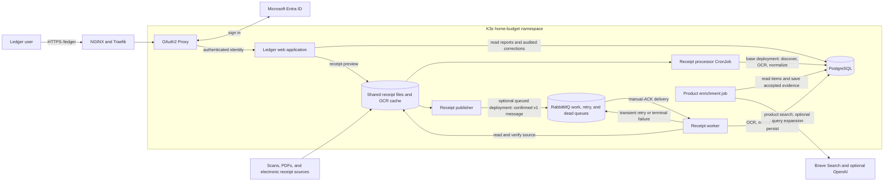
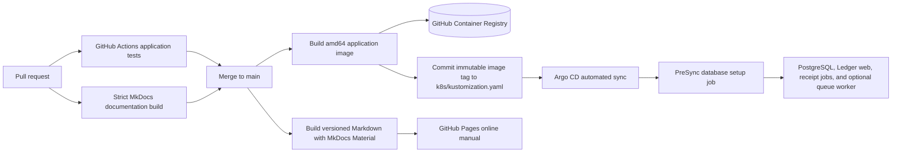

# BrownRook Ledger solution architecture

BrownRook Ledger turns receipt files and electronic purchase records into
canonical expenses, categorized line items, review data, and budget reports.
PostgreSQL is the system of record. Receipt files and OCR cache artifacts stay
on shared storage; RabbitMQ carries work references only.

## Runtime components and data flow

The base Kubernetes deployment runs receipt discovery and processing in one
CronJob every 15 minutes. The optional `deploy/rabbitmq` overlay changes that
CronJob into a publisher and adds RabbitMQ plus a long-running worker. Both
modes call the same processing code and use the same PostgreSQL status tables.

The main processing path is:

1. Discover a source file and calculate its SHA-256 hash.
2. Check PostgreSQL processing and evidence state for completion or exhaustion.
3. Run OCR, parse and normalize the receipt, and reconcile totals.
4. Store OCR evidence, the canonical expense, line items, and final processing
   status in PostgreSQL.
5. Apply deterministic and approved learned category rules, with optional AI
   classification only after rule-based matching fails.
6. Present receipts, expenses, review queues, reconciliation, duplicates, and
   category reports in Ledger.

In queued mode, delivery is at least once. A PostgreSQL advisory lock serializes
workers for the same source hash, and completed database state makes a duplicate
delivery safe. The consumer acknowledges a message only after the database
result or a retry/dead-letter transfer is durable. See the
[RabbitMQ design](rabbitmq-receipt-design.md) for those boundaries in detail.

## Persistence boundaries

| Component | Stores | Role |
| --- | --- | --- |
| Shared storage | Original receipt files and OCR cache JSON | Durable source evidence and reusable extraction artifacts |
| PostgreSQL | Processing state, OCR runs, evidence, canonical expenses, line items, categories, audit history, and analytics views | Authoritative application state |
| RabbitMQ | Versioned source hash and relative-path work messages | Optional transient work distribution, retry delay, and dead-letter inspection |

Ledger read queries use read-only database transactions. Category overrides,
category rules, and item description/product-link corrections use explicit
transactions and record the authenticated user in audit history.

## Build and deployment flow

The PostgreSQL init container uses the stable schema-bootstrap image for a new
volume. Existing databases are upgraded by the versioned PreSync job before
application workloads roll forward. Kubernetes secrets and storage credentials
are created outside Git.

For operator commands and recovery procedures, see the
[operations runbook](operations-runbook.md). For end-user review workflows, see
the [Ledger user guide](user-guide.md).
